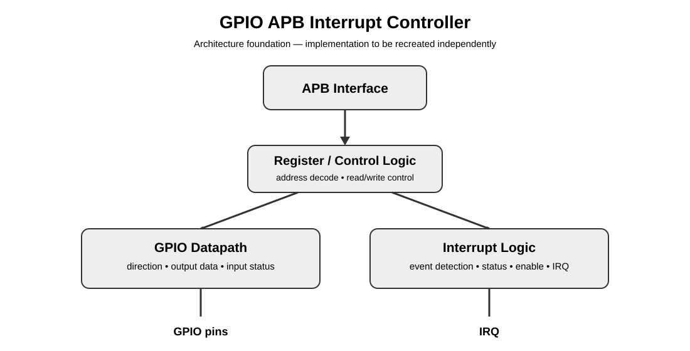

# GPIO APB Interrupt Controller

> A Verilog RTL project for designing and verifying an APB-connected GPIO controller with interrupt support.



## Project status

**Documentation / architecture foundation — implementation to be recreated.**

This repository is being rebuilt from the ground up. The original implementation files are currently unavailable, so this first commit intentionally contains **no RTL, testbench, or implementation taken from another person's project**.

The architecture, interface intent, verification plan, documentation structure, and project presentation are being established first. Our own Verilog implementation will be added later as it is recreated and verified.

---

## What this project is about

The project combines three hardware ideas into one small RTL subsystem:

- **APB interface** — a simple, register-oriented programming interface for a host/bus master.
- **GPIO block** — configurable digital input/output pins exposed through memory-mapped registers.
- **Interrupt generation** — event detection that can notify the host when configured GPIO activity occurs.

The intended end-to-end relationship is:

```text
                    APB BUS
                       │
                       ▼
              ┌─────────────────┐
              │   APB Interface │
              └────────┬────────┘
                       │
                       ▼
              ┌─────────────────┐
              │ Register /      │
              │ Control Logic   │
              └───────┬─────────┘
                      │
             ┌────────┴────────┐
             ▼                 ▼
      ┌─────────────┐   ┌──────────────┐
      │ GPIO Data / │   │ Interrupt /  │
      │ Direction   │   │ Event Logic  │
      └──────┬──────┘   └───────┬──────┘
             │                  │
             ▼                  ▼
          GPIO I/O            IRQ
```

This is an **architecture target**, not a claim that the RTL already exists in this repository.

## Main objectives

1. Build a clean APB slave interface.
2. Provide programmable GPIO direction and data control.
3. Allow GPIO inputs to be observed through software-visible registers.
4. Define a clear interrupt/event model.
5. Keep the design modular enough for simulation, synthesis and FPGA-oriented testing.
6. Verify the design systematically rather than relying only on a few waveform examples.

## Planned architecture

| Block | Responsibility | Status |
|---|---|---|
| APB interface | APB transaction handling and address/control decoding | Planned |
| Register bank | Software-visible configuration/status registers | Planned |
| GPIO datapath | Input sampling and output driving | Planned |
| Direction control | Select input/output behaviour per GPIO | Planned |
| Interrupt logic | Detect configured GPIO events and generate IRQ | Planned |
| Testbench | Bus transactions, GPIO stimulus and checking | Planned |
| Assertions / checks | Protocol and functional sanity checks | Planned |

Exact widths, register addresses, interrupt semantics and implementation details will be frozen when the design is recreated rather than being copied from the reference material.

## Register-map concept

The software-facing register space will be organized around the GPIO controller's control and status needs.

```text
Address space
│
├── GPIO configuration
│   ├── Direction
│   ├── Output data
│   └── Input status
│
├── Interrupt configuration
│   ├── Enable / mask
│   ├── Event configuration
│   └── Pending / status
│
└── Optional identification / control registers
```

The final register addresses and bit fields will be documented here once our implementation is defined.

## APB transaction flow

A typical write is expected to follow the APB two-phase structure:

```text
SETUP                         ACCESS
─────                         ──────
PSEL = 1                      PSEL = 1
PENABLE = 0        ───────►   PENABLE = 1
Address valid                 Write data valid
Write control valid           Transfer completes
```

For a read, the peripheral will return the selected register value during the APB access phase.

The final RTL will explicitly handle the required APB protocol signals and transfer timing.

## GPIO behaviour

The GPIO side is planned around the familiar separation between:

```text
              ┌──────────────┐
Output data ─►│              │
Direction ───►│ GPIO control │──► GPIO pins
              │              │
GPIO pins ───►│ Input status │
              └──────────────┘
```

A pin configured as an output is driven from the output-data path. A pin configured as an input is observed by the input-status path.

## Interrupt concept

The interrupt block will sit between GPIO activity and the host-visible control/status registers:

```text
GPIO input/activity
        │
        ▼
 Event detection
        │
        ▼
 Event qualification
        │
        ├────► Pending/status
        │
        ▼
 Interrupt enable/mask
        │
        ▼
       IRQ
```

The exact edge/level behaviour, clearing mechanism and priority rules are intentionally left open until the design is reimplemented.

## Verification plan

Verification will be built around functional scenarios rather than only checking that signals toggle.

### APB

- Valid reads
- Valid writes
- Address decoding
- Read/write register behaviour
- Reset behaviour
- Protocol timing

### GPIO

- Input observation
- Output driving
- Direction changes
- Reset values
- Multiple GPIO channels, once the final width is frozen

### Interrupts

- Event detection
- Enable/mask behaviour
- Pending status
- Interrupt assertion
- Interrupt clearing/acknowledgement
- Reset behaviour

### Integration

```text
APB master model
       │
       ▼
┌─────────────────────┐
│ GPIO APB Controller │
└──────────┬──────────┘
           │
     ┌─────┴─────┐
     ▼           ▼
 GPIO stimulus   IRQ monitor
```

Waveforms, directed tests, assertions and coverage will be added together with our own implementation.

## Repository structure

```text
GPIO_APB_Interrupt_Controller/
│
├── README.md
│
├── docs/
│   ├── architecture.md
│   ├── apb-interface.md
│   ├── register-map.md
│   ├── interrupt-model.md
│   ├── verification-plan.md
│   └── diagrams/
│       └── system-overview.svg
│
├── rtl/                    # Own implementation — to be added
├── tb/                     # Own verification environment — to be added
├── sim/                    # Simulation scripts/results — to be added
└── fpga/                   # Optional FPGA/project files — to be added
```

## Important note about reference material

This project was originally developed under external guidance, and reference material from a friend's separate implementation was available during reconstruction. **That material is not being used as source code for this repository.**

The current repository intentionally contains only newly written project documentation and architecture material. The RTL and testbench will be recreated independently.

## Roadmap

- [x] Establish project identity and repository structure
- [x] Document intended architecture
- [x] Define APB/GPIO/interrupt responsibilities
- [x] Add visual architecture documentation
- [ ] Freeze our own register map
- [ ] Recreate APB RTL
- [ ] Recreate GPIO RTL
- [ ] Recreate interrupt RTL
- [ ] Build independent testbench
- [ ] Run simulation and debug waveforms
- [ ] Add assertions and functional coverage
- [ ] Synthesize and review hardware results
- [ ] Add final implementation and verification results

## License

License to be decided.
